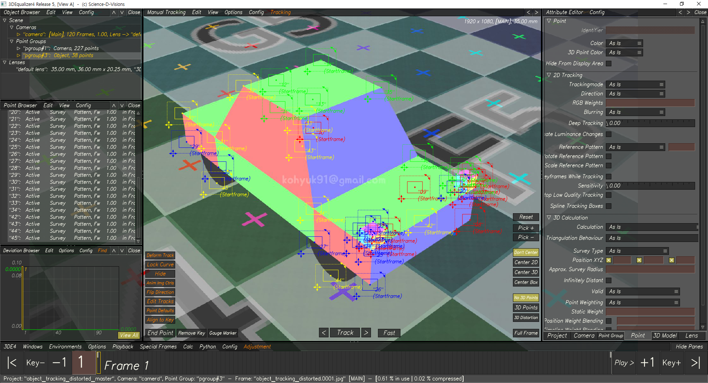
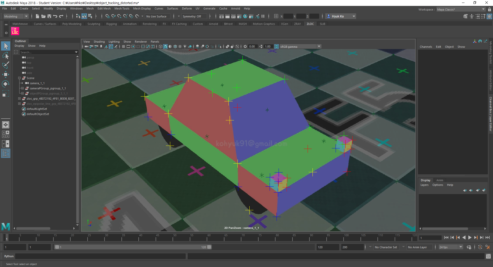
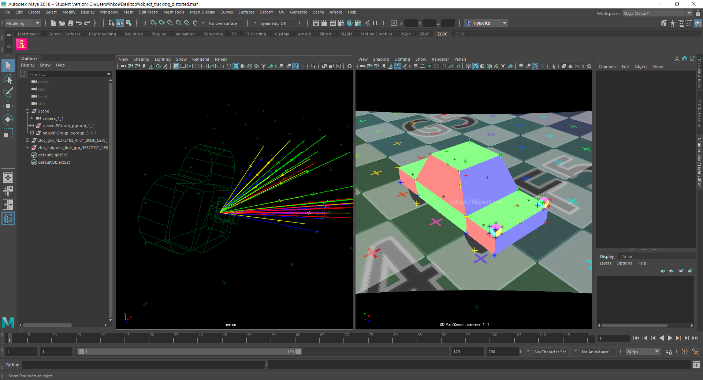
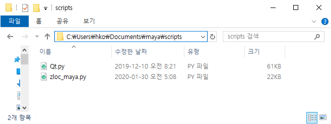
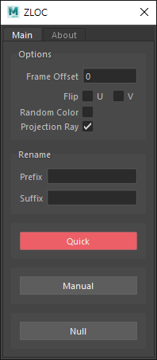
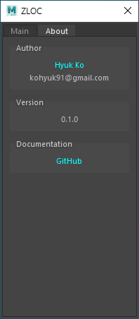
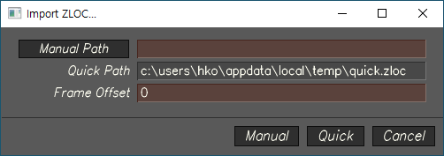
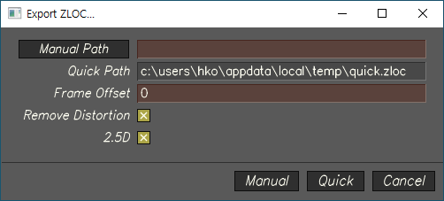

# ZLOC
## What does it do
ZLOC is a 2.5D tracker system built for Science-D-Visions 3DEqualizer and Autodesk Maya. (Based on SynthPipe by Martin Kulig)


## The 'Quick' Workflow
Setting up a 2.5D tracker system by hand can be very time consuming(and boring). ZLOC takes care of all of the tedious setup stuff, so artists can focus more on their work.

What you should be using most of the time is the 'Quick' feature. This is what makes ZLOC so easy to use.

> [](http://www.youtube.com/watch?v=OY7vK4RYl0w "")<br>
> [ZLOC Quick Workflow - Youtube](https://youtu.be/OY7vK4RYl0w)
## Features
### Inherit 2D Track Color
> <br>
> 
### Projection Ray
> 
### And more...
- Time Offset
- Flip Trackers
- Random Color
- Rename

## Releases
| Releases | Description |
| :--------: | :------------: |
| v0.1.2 | Maya 2017 and above does not require "Qt.py" anymore.|
| v0.1.1 | Naming correction. "Epipolar Line" to "Projection Ray".|
| v0.1.0 | Initial release |

## Roadmap
- [ ] 3DEqualizer Rolling Shutter Support
- [ ] 2D track translator between Matchmove Softwares(3DEqualizer, PFTrack, Syntheyes, etc)

## Maya
### Installation
1. Copy **[zloc_maya.py](maya/scripts/zloc_maya.py)** to:
    - Windows
        > \Users\USERNAME\Documents\maya\scripts<br>
        > 
    - Mac
        > $HOME/maya/scripts
    - Linux
        > $HOME/maya/scripts
    - For Maya 2016 and under, must install **[Qt.py(Latest release)](https://github.com/mottosso/Qt.py/releases)**
1. Launch/Restart Maya
1. In Maya, open a Python Tab in the Script Editor and execute:
    > ```python
    > import zloc_maya
    > try:
    >     zm.close()
    >     zm.deleteLater()
    > except:
    >     pass
    > zm = zloc_maya.ZLOC()
    > ```
### Interface
#### Main Tab
> 
- Options
    - Frame Offset: Offsets the `time` of all keyframes at creation stage.
    - Flip U: If checked, `-1` is multiplied to ZLOC's U attribute.
    - Flip V: If checked, `-1` is multiplied to ZLOC's V attribute.
    - Random Color: If checked, assigns a random color for each ZLOC and projection ray.
    - Projection Ray: If checked, creates an projection ray for each ZLOC at creation stage. `On` and `Hidden` by default.
- Rename
    - Prefix: Adds a prefix to all ZLOC trackers at creation stage.
    - Suffix: Adds a suffix to all ZLOC trackers at creation stage.
- Quick:
    1. Read `OSTEMPDIR/quick.zloc`
    1. Create ZLOC
- Manual:
    1. Opens a file browser dialog. Get file path.
    1. Read from given file path.
    1. Create ZLOC
- Null: Use this to create a single ZLOC with no keyframe.
#### About Tab
> 

## 3DEqualizer
### Installation
- Copy **[import_zloc_3de.py](3de/import_zloc_3de.py)** and **[export_zloc_3de.py](3de/export_zloc_3de.py)** to:
    - Windows
        > $3DEVERSION\sys_data\py_scripts
    - Mac
        > $3DEVERSION/sys_data/py_scripts
    - Linux
        > $3DEVERSION/sys_data/py_scripts
### Interface
#### import_zloc_3de.py
> 
- Manual Path:
    1. Opens a file browser dialog. Get file path.
    1. Read zloc file from given path.
- Quick Path: Read zloc file from `OSTEMPDIR/quick.zloc`.
- Frame Offset: Offsets the `time` of all keyframes.
#### export_zloc_3de.py
> 
- Manual Path:
    1. Opens a file browser dialog. Get file path.
    1. Write zloc file to given path.
- Quick Path: Write zloc file to `OSTEMPDIR/quick.zloc`.
- Frame Offset: Offsets the `time` of all keyframes.
- Remove Distortion: If checked, U & V values will account for distortion.
- 2.5D: If checked, exports 2.5D trackers. If unchecked, exports 2D Tracks.


---

## How it works
### [Part 1 - Create Poly Image Plane](https://kohyuk91.github.io/posts/20191214_poly_image_plane_zloc_part1/)
### [Part 2 - Create 2.5D Locator](https://kohyuk91.github.io/posts/20191215_two_point_five_dee_locator_zloc_part2/)
